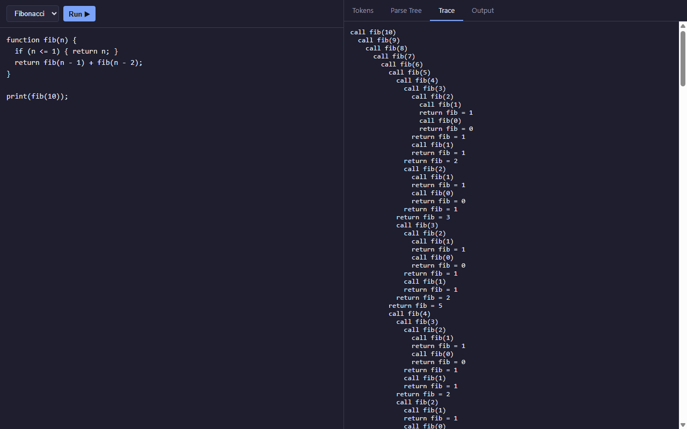

# Twig

Twig is a small interpreted language: a hand-written lexer, a recursive-descent
parser, and a tree-walking evaluator, wrapped in a single-file HTML/CSS/JS
playground (no build step) that shows tokens, parse tree, and execution trace
live as code runs.

**[Try it live](https://dulattastanbay-dev.github.io/twig-interpreter/)**



## Language

- Types: numbers, strings, booleans, first-class functions
- `let x = expr;` declarations, `x = expr;` assignment
- `if (cond) { } else { }`, `while (cond) { }` — braces are mandatory, there is
  no bare single-statement form
- `function name(params) { ...; return expr; }` — functions are first-class
  values and close over the scope they were *defined* in (proper lexical
  scoping), not the scope they're called from
- Operators: `+ - * / %`, `== != < <= > >=`, `&& || !`
- `print(expr);` for output, `// comment` to end of line

**Design note:** `if`/`while` conditions must evaluate to an actual boolean.
`if (5) { }` is a runtime type error, not silently coerced — a deliberate
choice to avoid JS-style truthiness footguns.

## Architecture

```
source text -> Lexer -> tokens -> Parser (recursive descent) -> AST -> Evaluator (tree-walking) -> output
```

Everything — lexer, parser, evaluator, and the playground UI — lives in one
file, `index.html`. There's no build step and no external dependencies; open
the file (or serve it statically) and it runs.

## Error handling

Twig is built to fail predictably instead of crashing the browser tab:

| Case | Behavior |
|---|---|
| Division or modulo by zero | Runtime error: `Division by zero` |
| Deep/infinite recursion | Runtime error: `Stack overflow: max call depth exceeded` at a fixed depth of 200 — well below the point where the underlying JavaScript engine would throw its own native stack error |
| Unterminated block, string, or parenthesized expression | Parse or lex error naming what was expected and where |
| Calling a value that isn't a function | Runtime error: `TypeError: <value> is not callable` |
| Referencing an undefined variable | Runtime error: `Undefined variable: <name>` |

Every error carries a line and column and is caught before it reaches the
browser console — the playground shows it in a banner, along with whatever the
Tokens/Parse Tree/Trace tabs managed to produce before the failure.

## Running locally

```bash
python -m http.server 8000
# open http://localhost:8000/
```

## Tests

The lexer, parser, and evaluator have a Node-based unit test suite
(`node:test`, no dependencies, no build step — it extracts the same code that
ships in `index.html` and runs it in a sandbox):

```bash
node --test tests/
```

## License

MIT — see [LICENSE](LICENSE).
